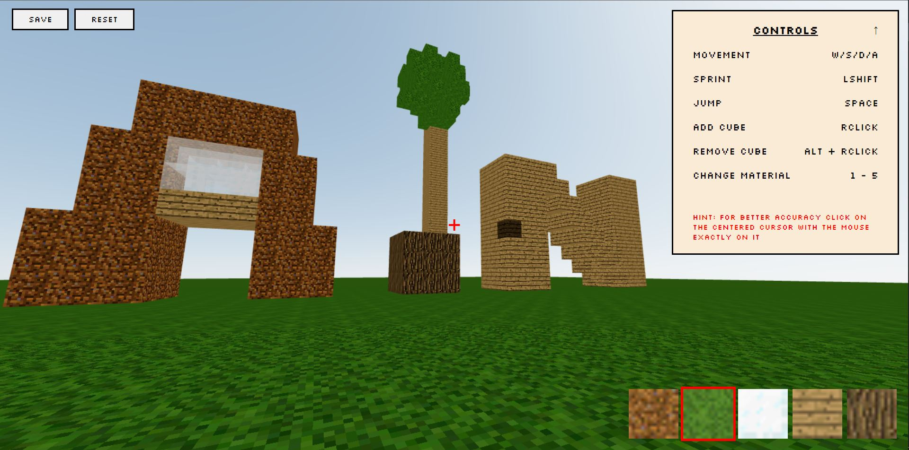

# Minecraft Game Using React, Three.js 🧱⛏️

CHECK LIVE DEMO: [Minecraft](https://minecraft-kappa.vercel.app/)

## How to Play?

1. You can move with (W/S/D/A). 🚶🏻‍♂️
2. You can hold (LShift) while moving to increase your speed. 🏃‍♂️
3. You can jump with (Space). 🤸🏽‍♂️
4. You can build everything you want by simply point to the place then click (RClick). ⚒️
5. You can destroy any cube you have built by mistake (Alt + RClick). 🚧
6. You can choose between 5 materials of blocks (dirt, grass, glass, wood, log). 🟠🟢🟣⚪🔴
7. You can save your entire world. 📜
8. You can reset your world if you got bored. 💨
